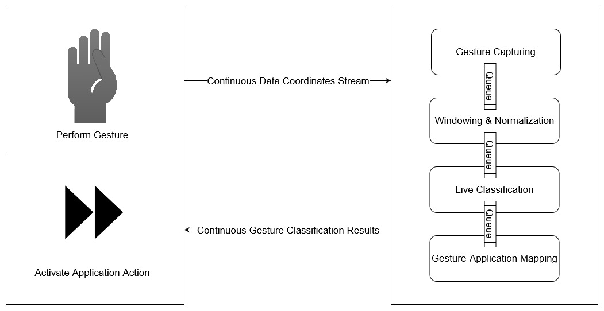

# GR2 AM
GR2AM, is the project we created for the Physical Computing Seminar, at Saarland University with the [HCI Lab](https://hci.cs.uni-saarland.de/).
GR2AM is a  proof of concept towards creating  a  simple-to-use software  in  the  scope  of  Human-Computer Interaction, to create  a  gesture  recognition, and application-mapping system, in hopes of facilitating the interaction with smart computing and IoT devices.
GR2AM is a hybrid-learning based model, with a user-friendly interface, to easily record gestures, either from a predefined set of nine gestures, or create up to six unique custom  gestures, map  them  to  trigger certain  applications, and process incoming, real-time, data streams.
The hybrid-learning model consists of a 1D-CNN and a Random-Forest Classifier, trained on a minimal dataset of 10 samples for each gesture, to produce a real-time accuracy of 82.85%, from a stream of 30 frames of 21 hand landmarks captured using a built-in webcam by using the MediaPipe Python Module.
#### Main Tools
 - MediaPipe & OpenCV, for gesture capturing
 - PyTorch, for the 1D-CNN
 - Scikit-learn, for the Random-Forest Classifier
 - Web UI
	 - Flask, for the backend web framework
	 - Bootstrap, for the frontend framework
	 - Jinja, a template engine
	 - CSS, for styling
	 - Javascript, for all the interactive parts of the UI

#### Overview of the working pipeline
 
